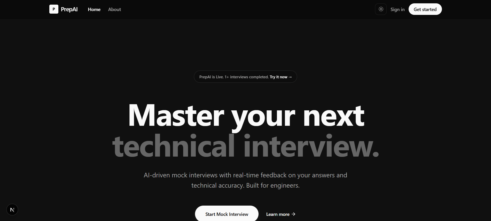

# PrepAI 🚀

PrepAI is an AI-powered interview preparation platform designed to help students and job seekers improve their interview performance through resume analysis, AI-generated interview questions, mock interviews, and performance evaluation.

<p align="center">
  
</p>

## 🌟 Features

- 📄 AI Resume Analysis
- 🎯 Personalized Interview Questions
- 🎤 Voice-Based Mock Interviews
- 📹 Camera & Microphone Based Confidence Analysis
- 📊 Automated Performance Reports & Scoring
- 🧠 Question Bank for Practice
- 💻 Modern Responsive UI

---

## 🛠️ Tech Stack

### Frontend
- Next.js
- React.js
- TypeScript
- Tailwind CSS

### Backend / Services
- Firebase FireStore
- Firebase (OAuth)
- AWS S3 Storage
- VAPI.AI
- Python + Flask
- TensorFlow
- AI APIs (OpenAI / Gemini / Other APIs)

---

## 🚀 Live Demo

🔗 **Live Website:** [https://prepai-iota.vercel.app/](https://prepai-iota.vercel.app/)

---

## 🎥 Project Demo

<p align="center">
  <a href="https://www.youtube.com/watch?v=yf2v3BbdI70">
    
  </a>
</p>

> Click the image above to watch the demo video on YouTube.

---

## ⚙️ Installation & Setup

Clone the repository:

```bash
git clone https://github.com/Daksh-Official/prepai.git
```

Move into the project directory:

```bash
cd prepai
```

Install dependencies:

```bash
npm install
```

Run the development server:

```bash
npm run dev
```

---

## 🤝 Contributors

### 👨‍💻 Daksh Gupta
- portfolio: [https://www.dakshgupta.in/](https://www.dakshgupta.in/)
- LinkedIn: [https://www.linkedin.com/in/daksh-gupta-6a4816262/](https://www.linkedin.com/in/daksh-gupta-6a4816262/)

### 👨‍💻 Kartik
- GitHub: [https://github.com/kartikkumar925800](https://github.com/kartikkumar925800)
- LinkedIn: [https://www.linkedin.com/in/kartikkumar925800/](https://www.linkedin.com/in/kartikkumar925800/)

---

## 📌 Future Improvements

- Real-time AI Interview Agent
- Better Behavioral Analysis
- Multi-language Interview Support
- Advanced Analytics Dashboard

---

## ⭐ Support

If you liked this project, consider giving it a ⭐ on GitHub!